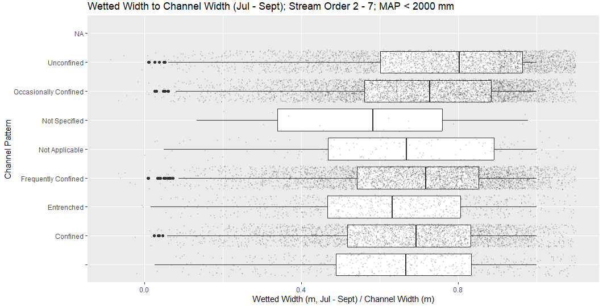

# BC Stream Inventory Sample Sites and BCFWA

## Overview

The BC Stream Inventory Sample Sites (SISS records) is a valuable database that compiles thousands of standardized instream measurements from the BC Fisheries Information Summary System (FISS) records across BC. This analysis applied various filter criteria and rules to snap the BC Stream Inventory Sample Sites point observations onto stream reaches from the BC Freshwater Atlas. Various rules and criteria were applied to the SISS database to QA/QC records and snap features onto the BC Freshwater Atlas (BCFWA). Point records within `siss_records_bcfwa.csv` are attribtued with a corresponding BCFWA `GROUP_CODE` and `LINEAR_FEATURE_ID` such that records can be joined onto the BCFWA streamlines.

<!-- If the image lives in a subfolder called "images/": -->

*Figure 1. Overview of BC Stream Inventory Sample Sites.*

* BC Stream Inventory Sample Sites (SISS records): https://catalogue.data.gov.bc.ca/dataset/stream-inventory-sample-sites/resource/6730ec79-9e70-4fc1-a021-6530a8910686
* BC Freshwater Atlas: https://www2.gov.bc.ca/gov/content/data/geographic-data-services/topographic-data/freshwater

## Methods

The following steps were applied to filter out SISS records that had obvious issues. Automated geocoding steps were also undertaken to ensure that SISS records snapped on to the correct stream reach in the BCFWA. This is essnetial since snapping by distance alone generally results in numerous issues as records from mainstem reaches snap to tributaries and visaversa.

- SISS records were downloaded from the BC Data Catalogue on April 30, 2022.
- Several steps and sub-steps were undertaken to ensure that SISS records were successfully joined to the correct BCFWA stream reach. For each record, the following processing steps were followed:
  1. First, we excluded all stream reaches that were 1,500 m away from the SISS records location.
  2. Next, we reviewed the watershed code `NEW_WS_CD`. If a watershed code was defined (not NULL) then we excluded all BCFWA stream reaches that did not contain a matching BC Bluelines 50K code ` WATERSHED_CODE_50K` from the BCFWA.
  3. Points were then snapped onto the closest line segment. The old coordinates are recorded in columns `GIS_UTM_EASTING` and `GIS_UTM_NORTHING`. The new x, y, and z (elevation) coordinates are recorded in columns `new_x`, `new_y`, `new_z`, along with the snapping distance ` snap_dist` in meters.
  4. Additional checks were performed to ensure that the stream name (if present) in the SISS records matched the stream name in the BCFWA (GAZTD_NAME and GAZETTED_NAME). Variations in spelling were allowed by up to five characters and manually reviewed.
  5. We discarded any records with a survey date < 1950, assuming that these would have georeferencing errors.
  6. We also excluded records where the reported wetted width or bankfull width was over 300m, instances where a visible channel was reported “No”, instances where the channel width or wetted width was reported as 0, and instances where the channel width was greater than the wetted width.
- These data processing and data cleaning steps (in our opinion) alleviated many of the errors and anomalies in the raw BC SISS dataset. We also added additional field attributes from the BCFWA to support various future analysis and modelling tasks from the SISS records.
- This data filtering exercise results in about ~65,000 SISS records successfully snapped to BCFWA stream reaches.

## Field Attributes

The following table describes the columns in `siss_records_bcfwa.csv`.

| Column Name         | Data Type | Description                                                                                                         |
|---------------------|-----------|---------------------------------------------------------------------------------------------------------------------|
| `GROUP_CODE`        | String    | Group code from the BCFWA (e.g., LFRA, SQAM, etc.).                                                                 |
| `LINEAR_FEATURE_ID` | Integer   | Linear Feature ID from the BCFWA (unique streamline attribute).                                                      |
| `stream_order`      | Integer   | Stream Order from BCFWA.                                                                                             |
| `snap_dist`         | Numeric   | Snap distance in meters from original location.                                                                     |
| `epsg_code`         | Integer   | EPSG code for UTM zone (spatial projection code for GIS).                                                           |
| `new_x`             | Numeric   | New x location after snapping (see `epsg_code` for projection).                                                      |
| `new_y`             | Numeric   | New y location after snapping (see `epsg_code` for projection).                                                      |
| `new_z`             | Numeric   | New z location (elevation) after snapping.                                                                          |
| `date`              | String    | Survey date from SISS record (if available).                                                                         |
| `reach_slope`       | Numeric   | Reach slope calculated from rise/run and BCFWA z (elevation geometry). Can be compared to field-measured channel slope (`GRADIENT`). |
| `sinuosity`         | Numeric   | Stream reach sinuosity calculated from the BCFWA streamline geometry.                                                |

> **All Other Columns:** See the BC Data Catalogue: Stream Inventory Sample Sites for a detailed description of all other column attributes from the BC SISS database.

## Use Cases

Various use case applications include model validation and calibration for instream features such as canopy cover, stream channel geometry, bed type, etc.

<!-- If the image lives in a subfolder called "images/": -->

*Figure 2. Example use case application: reviewing change in stream channel geometry parameters across channel pattern clases*

## Footnotes and Citation

Use this dataset at your own discretion. Standalone R code to process records will be made available soon. Reccomended Citation:

Bayly, M. J. (2025, June 5). *BC Stream Inventory Sample Sites and BCFWA* [Derived Data set]. GitHub. Retrieved June 5, 2025, from https://github.com/mattjbayly/siss

---