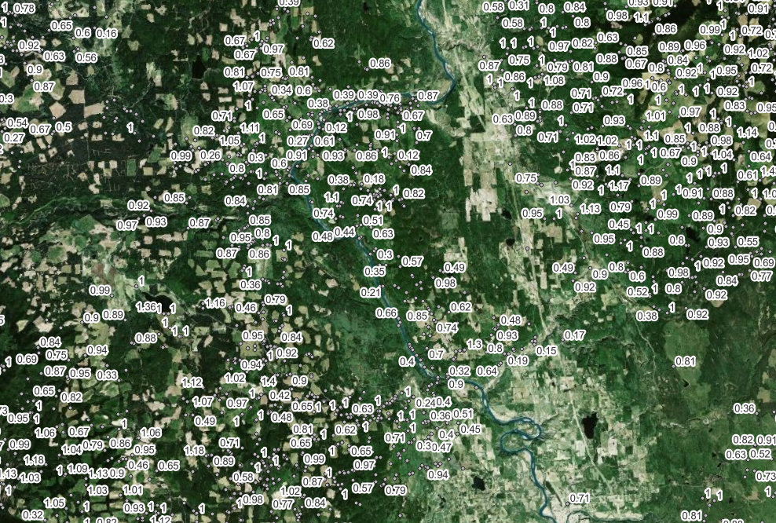

# BC Stream Inventory Sample Sites and BCFWA

https://catalogue.data.gov.bc.ca/dataset/stream-inventory-sample-sites/resource/6730ec79-9e70-4fc1-a021-6530a8910686

## Overview

The BC Stream Inventory Sample Sites (SISS records) is a valuable database that compiles thousands of standardized instream measurements from the BC Fisheries Information Summary System (FISS) records across BC. This analysis applied various filter criteria and rules to snap the BC Stream Inventory Sample Sites point observations onto stream reaches from the BC Freshwater Atlas. Various rules and criteria were applied to the SISS database to QA/QC records and snap features onto the BC Freshwater Atlas (BCFWA). Point records within `siss_records_bcfwa.csv` are attribtued with a corresponding BCFWA `GROUP_CODE` and `LINEAR_FEATURE_ID` such that records can be joined onto the BCFWA streamlines.

<!-- If the image lives in a subfolder called "images/": -->

## Methods

Below is a short, illustrative Methods section. Adapt this to describe your own data processing, analysis, or experimental workflow.

1. **Data Collection**  
   - Raw data were obtained from publicly available sources, including government open-data portals and partner organizations.  
   - Each dataset was downloaded in CSV format and stored in the `data/raw/` directory.

2. **Data Cleaning & Preprocessing**  
   - The raw CSV files were inspected for missing values, inconsistent formatting, and duplicate records.  
   - Custom R scripts (see `scripts/cleanup.R`) were used to normalize column names, cast data types, and remove any records with critical fields missing.  
   - All date fields were standardized to ISO 8601 format (`YYYY-MM-DD`).

3. **Data Analysis**  
   - Processed data were imported into an R environment.  
   - Summary statistics (mean, median, standard deviation) were computed for each numeric field.  
   - A simple linear regression model was fit to explore the relationship between `Variable_A` and `Variable_B`.  
   - Visualization scripts (in `scripts/visualize.R`) generate time series plots and scatterplots to illustrate key findings.

4. **Reproducibility**  
   - All dependencies are listed in `requirements.txt` (for Python) or `DESCRIPTION` (for R).  
   - To reproduce the analysis, install the dependencies and run the scripts in order:
     1. `scripts/cleanup.R`
     2. `scripts/analyze.R`
     3. `scripts/visualize.R`

## Data Dictionary

The following table describes the columns in `data/processed/sample_data.csv`. Feel free to extend this table with additional fields as needed.

| Column Name        | Data Type    | Description                                                    |
|--------------------|--------------|----------------------------------------------------------------|
| `record_id`        | Integer      | Unique identifier for each observation.                        |
| `event_date`       | Date         | Date of the event (ISO 8601 format: YYYY-MM-DD).               |
| `location`         | String       | Location where the measurement was taken (e.g., city name).    |
| `Variable_A`       | Numeric      | Primary measurement variable A (e.g., temperature in °C).      |
| `Variable_B`       | Numeric      | Secondary measurement variable B (e.g., humidity in %).        |
| `status_flag`      | Boolean      | Indicates whether the record passed quality control (`TRUE`/`FALSE`). |
| `notes`            | String       | Free-text notes or comments associated with each record.       |

> **Tip:** If you add new columns to the CSV, update this table accordingly. This helps collaborators understand your data without having to inspect raw files.

## Footnotes

Some additional context or external references can be provided as footnotes. For example, if you rely on an external dataset or a published paper, you can cite it here:

This analysis uses temperature and humidity data from a regional monitoring station. For more details on the monitoring protocol, see the official documentation[^1].

[^1]: See _BC Stream Inventory Sample Sites Data Record_ (2022) at [https://catalogue.data.gov.bc.ca/dataset/stream-inventory-sample-sites/resource/6730ec79-9e70-4fc1-a021-6530a8910686](https://catalogue.data.gov.bc.ca/dataset/stream-inventory-sample-sites/resource/6730ec79-9e70-4fc1-a021-6530a8910686)

---